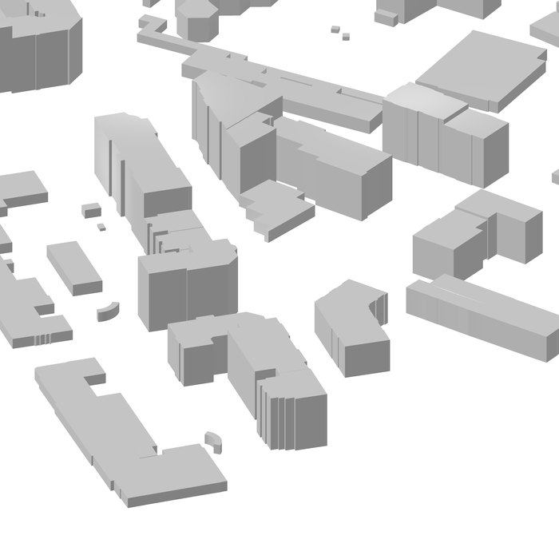
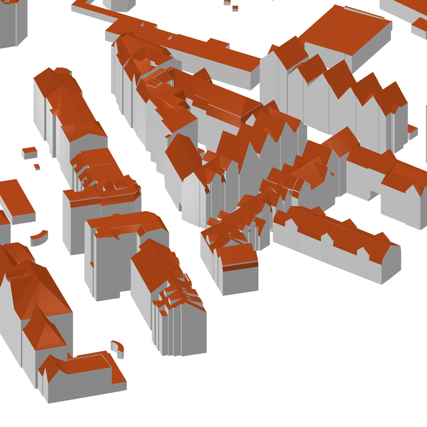
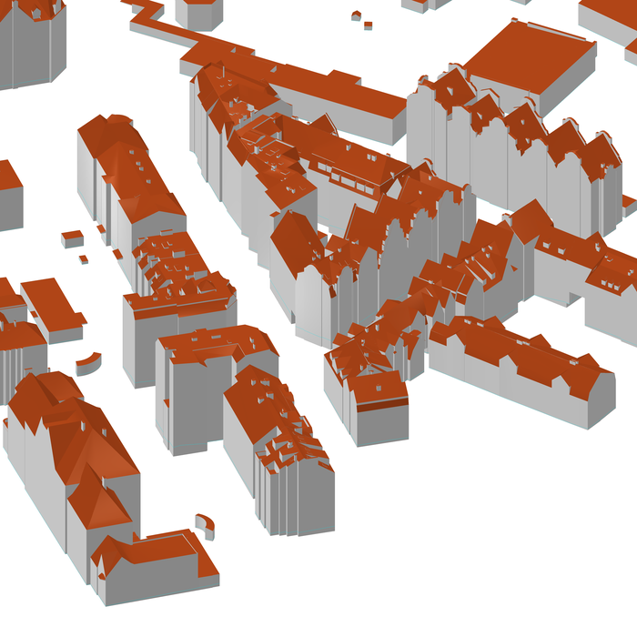

# CitySmith

A CityGML enhancer. It takes a detailed CityGML building model and enriches it:
deriving lower levels of detail, filling in missing semantics, checking geometric
quality, and converting to other encodings, all while leaving the original data
intact.

The first working capability derives a **LOD2** representation from **LOD3**
buildings and embeds it alongside the LOD3, so a single file carries both.

> Status: early development. LOD derivation, semantics, CityJSON export and the
> CityDoctor2 validation bridge all work end to end and are tested. See the
> [Roadmap](docs/DESIGN.md#roadmap) for what's planned next.

## Example output

The same building block derived down from LOD3 to LOD2 to LOD1 with `citysmith lod`:

<table width="40%">
<tr>
<td align="center" width="33%"><br><sub><b>LOD1</b> (derived): block model, extruded from the footprint</sub></td>
<td align="center" width="33%"><br><sub><b>LOD2</b> (derived): facade detail removed, roof shape kept</sub></td>
<td align="center" width="33%"><br><sub><b>LOD3</b> (source): windows, doors, roof detail</sub></td>
</tr>
</table>

## Why

Detailed CityGML (from photogrammetry or facade modelling) sometimes ships as rich
LOD3 with windows, doors and roof detail, but nothing else. Downstream work
(energy and flood simulation, generalized web maps, storage in 3DCityDB, GIS
pipelines) usually wants a cleaner LOD2, lower LODs, consistent semantics, or a
CityJSON encoding. CitySmith produces those from what you already have.

## Capabilities

| Area | What it does | Status |
| --- | --- | --- |
| `lod` | Derive and embed lower LODs (LOD0 footprint, LOD1 block, LOD2 shell) from LOD3 | done |
| `semantics` | Fill missing ids, `function`, `type` attributes and `lod3Geometry` aggregates per a rulebook | easy tier done |
| `convert` | Emit CityJSON 1.1 (validated through cjio, upgrades cleanly to 2.0) | done |
| `validate` | Native watertightness report, plus a bridge to the CityDoctor2 external validator | done |

## Scope

CitySmith is deliberately narrow. It works on:

- **CityGML 2.0**, the **Building module only** (`bldg:Building`,
  `bldg:BuildingPart`). CityGML also defines separate modules for bridges,
  tunnels, transportation, vegetation, water bodies, land use, city furniture
  and terrain relief; none of those are read, written or even parsed, a
  Bridge or Vegetation feature in the input file passes through completely
  untouched. CityGML 1.0 and 3.0 are not supported.
- **Downgrading only**: LOD3 to LOD0/1/2. There is no LOD4 (interiors), and no
  path that upgrades a lower LOD into a higher one.
- **Semantic enrichment, easy tier only**: ids, `function` codes, `type`
  attributes, `lod3Geometry` aggregation, and specifically balcony/chimney
  classification for `BuildingInstallation`. The hard tier (restructuring
  `BuildingPart`-modelled balconies, face reclassification by orientation) is
  not implemented yet, see the [Roadmap](docs/DESIGN.md#roadmap).

And explicitly does **not** touch:

- **Appearances, materials or textures.** This isn't a hypothetical gap:
  real photogrammetric exports (like the one this was tested against) often
  carry image-based `app:ParameterizedTexture` data with tens of thousands of
  texture-coordinate entries per file. CitySmith neither reads nor writes any
  of it. Existing LOD3 textures survive untouched in the output because LOD3
  geometry and ids are never modified, but every polygon CitySmith generates
  for LOD0/1/2 gets a fresh id, so none of the generated geometry can ever be
  textured (the source appearance's surface references only resolve against
  the original LOD3 ids). CityJSON export drops materials/textures entirely
  too. If you need textured lower LODs, this tool does not produce them.
- **Multiple coordinate reference systems in one file.** CitySmith assumes,
  per SIG3D Part 2 section 2.2's own recommendation, that `srsName` is
  declared once at the document level and inherited by every geometry; new
  geometry it generates relies on that inheritance rather than setting its
  own `srsName`. A file that legally but unusually declares different
  `srsName` values per polygon is not specially handled.
- **Buildings that are secretly several buildings.** See the honest note in
  [LOD3 to LOD1](#lod3-to-lod1-how-the-block-height-is-chosen) below.

## LOD3 to LOD2 today

For every building and building part that owns an `lod3Solid`, CitySmith:

- reuses the roof and ground faces,
- rebuilds each wall with its window and door holes filled,
- omits facade openings and roof superstructures from the LOD2,
- writes standards-compliant `lod2` boundary surfaces and an `lod2Solid`,
- keeps the LOD3 untouched (or, with `--lod2-only`, strips it for a LOD2 file),
- gives every new element a reproducible id, so re-runs are byte-identical.

## LOD3 to LOD1: how the block height is chosen

LOD1 is a single prism: the ground surface's footprint, extruded from a base
height up to a top height, per the [SIG3D Modeling Guide for 3D
Objects, Part 2](https://files.sig3d.org/file/ag-qualitaet/201311_SIG3D_Modeling_Guide_for_3D_Objects_Part_2.pdf),
section 2.1: "exactly one prismatic extrusion solid" per building or building
part. The base is the lowest point of the ground surface (**Min. Relief
Height** in the guide's own vocabulary, section 2.4 "Heights"). The top height
is chosen with `--lod1-height`, using the same section's named heights:

- **`average`** (default): **Average Roof Height**, the guide's own formula
  `(Min. Eaves Height + Max. Ridge Height) / 2`.
- **`eave`**: **Min. Eaves Height**, the lowest point of any roof surface, the
  most conservative option.
- **`ridge`**: **Max. Ridge Height**, the highest point anywhere in the shell,
  the tallest option.

All three are plain min/max over the shell's points, exactly as the guide
defines them, no clustering or weighting on top. See
[LOD1 (extruded block)](docs/DESIGN.md#lod1-extruded-block) in the design doc
for the full section reference.

LOD1 is still, by definition, one box per `Building`. If a `Building` in your
source data actually represents several real structures at substantially
different heights merged into a single feature (a common artifact of
ALKIS-footprint-driven or address-driven exports, where several real
buildings share one cadastral footprint or address and get exported as one
`Building`), none of the three height choices is a correct answer: the
guide's height model assumes one coherent roof, not a merger of unrelated
structures. That is a source-data modelling issue, not a CitySmith defect,
worth checking the export's metadata (in ours, the source description pointed
to this) before assuming the tool is wrong. Splitting such buildings into
separate `BuildingPart`s upstream is the correct fix. CitySmith does not yet
detect or flag this case automatically; it's a known limitation, tracked on
the [Roadmap](docs/DESIGN.md#roadmap).

### Honest note on watertightness

A closed LOD2 solid is only possible when the source LOD3 is itself a clean
closed shell. Real photogrammetric LOD3 usually is not: surfaces meet at
T-junctions and roof overhangs lack soffits, so the "solid" is a surface soup.
CitySmith does not silently pretend otherwise. It fills the window and door holes
(which genuinely improves closedness) and then **reports** the watertightness of
every building rather than guaranteeing it. If you need a guaranteed-closed
solid, LOD1 (extruded from the footprint) is watertight by construction; a
guaranteed-closed LOD2 would need geometric healing, which is out of scope for
this tool (see `validate` below).

## Validation: bridging to CityDoctor2

CitySmith's own `quality_buckets` report is a fast, dependency-free closedness
check. For a deeper, independently developed validation, `citysmith validate`
shells out to [CityDoctor2](https://transfer.hft-stuttgart.de/gitlab/citydoctor/citydoctor2),
a Java validator from HFT Stuttgart with a much larger OGC-QIE-aligned check
taxonomy: ring, polygon and shell-level geometry (self-intersection,
non-planarity, ring orientation, non-manifold edges/vertices, connected
components) plus a few semantic checks.

CityDoctor2 is not bundled (it is a large Java application with its own runtime).
Download a prebuilt release from
[citydoctorreleases](https://transfer.hft-stuttgart.de/gitlab/citydoctor/citydoctorreleases)
(`CityDoctorValidation-<version>-<os>.zip`), unzip it anywhere, and either pass
its path with `--citydoctor-home` or set `CITYSMITH_CITYDOCTOR_HOME`. No format
conversion is needed; CityGML goes in directly and an XML report comes out,
which CitySmith parses. Java 17+ is required unless you use a release that
bundles its own runtime (the official Windows/macOS/Linux zips do).

Note: CityDoctor2's own `-out` option does not currently repair geometry
automatically (verified, not just documented). It re-serializes the file with
per-feature error annotations instead. Treat `validate` as validate-and-report,
not auto-heal.

## Install

```bash
git clone https://github.com/banecronotse/citysmith.git
cd citysmith
pip install -e .
```

If the bare `citysmith` command isn't found afterward, your Python scripts
directory isn't on PATH yet. Either add it, or run everything as
`python -m citysmith.cli ...` instead, which always works regardless of PATH
(every example below uses the bare form for brevity, but both are equivalent).

## Usage

```bash
# Derive lower LODs and embed them next to the LOD3
citysmith lod city_lod3.gml --levels 0,1,2          # complete multi-LOD file
citysmith lod city_lod3.gml --levels 2              # just LOD2 (default)
citysmith lod city_lod3.gml --levels 2 --lower-only # LOD2-only file (strip LOD3)

# Fill in missing semantics (ids, function, type, aggregate geometry)
citysmith semantics city_lod3.gml -o city_sem.gml --report sem.json

# Export to CityJSON 1.1
citysmith convert city_multiLOD.gml -o city.city.json

# Validate with CityDoctor2 (needs a separate download, see Validation below)
citysmith validate city_lod3.gml --citydoctor-home /path/to/CityDoctorValidation-3.18.3
```

Python API:

```python
import citysmith
from citysmith.semantics import enhance_semantics
from citysmith.cityjson import convert

report = citysmith.enhance("city_lod3.gml", "out.gml", levels=(0, 1, 2), keep_lod3=True)
print(report.quality_buckets)          # LOD2 watertightness breakdown
enhance_semantics("city_lod3.gml", "city_sem.gml")
convert("out.gml", "city.city.json")
print(citysmith.validate_citydoctor("out.gml", citydoctor_home="/path/to/CityDoctorValidation").error_counts)
```

## Interoperability

- CityGML 2.0 in and out. Namespaces, prefixes and generic attributes preserved.
- Each LOD is self-contained (no fragile cross-LOD XLinks), which is friendlier
  to third-party readers.
- Reproducible ids for clean diffs and CI.
- Pure Python plus `lxml`; runs the same on Windows, macOS and Linux.

## Development

```bash
pip install -e ".[dev]"
pytest
```

## License

MIT. See [`LICENSE`](LICENSE).
