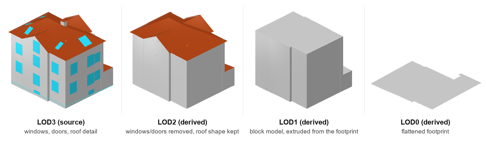

# CitySmith

A blacksmith for CityGML. It takes a building model and reshapes it: deriving
lower levels of detail, filling in missing semantics, checking geometric
quality, and converting to other encodings, all while leaving the original
data intact.

Four capabilities: `lod` derives lower levels of detail (LOD1 and LOD0 from
either LOD2 or LOD3 data, a clean LOD2 from LOD3), `semantics` fills in
missing ids and semantic attributes, `convert` exports to CityJSON, and
`validate` checks geometric quality, natively or through the CityDoctor2
bridge.

> Status: early development. LOD derivation, semantics, CityJSON export and the
> CityDoctor2 validation bridge all work end to end and are tested. See the
> [Roadmap](docs/DESIGN.md#roadmap) for what's planned next.

## Example output

The same real building (`tests/CS1_lod3.gml`, a CityGRID-style export with a
Building and a BuildingPart) derived from LOD3 down to LOD0 with `citysmith lod`:



Every file shown is in `tests/`, reproducible with
`citysmith lod tests/CS1_lod3.gml --levels 0,1,2`. This building is a real
export from CityGRID®, UVM Systems GmbH's software (see
[Which export style is my data?](#which-export-style-is-my-data) below).

## Why

There aren't enough tools for editing CityGML building data. Depending on the
use case, that data may need to be downgraded to a lower level of detail,
enriched with the semantics it's missing, or converted to CityJSON. CitySmith
produces those from what you already have.

## Capabilities

| Area | What it does | Status |
| --- | --- | --- |
| `inspect` | Read-only preflight: what geometry was found and what each capability can/can't do with it, no output written | done |
| `lod` | Derive and embed lower LODs: LOD1 block and LOD0 footprint from LOD3 or LOD2 data, a clean LOD2 shell from LOD3 | done |
| `semantics` | Fill missing ids, `function`, `type` attributes and `lod3Geometry` aggregates per a rulebook (needs LOD3) | easy tier done |
| `convert` | Emit CityJSON 1.1 (validated through cjio, upgrades cleanly to 2.0) | done |
| `validate` | Native watertightness report, plus a bridge to the CityDoctor2 external validator | done |

## Scope

CitySmith is deliberately narrow. It works on:

- **CityGML 2.0**, the **Building module only** (`bldg:Building`,
  `bldg:BuildingPart`). CityGML also defines separate modules for bridges,
  tunnels, transportation, vegetation, water bodies, land use, city furniture
  and terrain relief; none of those are read, written or even parsed, a
  Bridge or Vegetation feature in the input file passes through completely
  untouched. CityGML 1.0 and 3.0 are not supported.
- **Downgrading only**: LOD3 to LOD0/1/2, or LOD2 to LOD0/1 when there's no
  LOD3 present. There is no LOD4 (interiors), and no path that upgrades a
  lower LOD into a higher one, see [Which LOD is my
  data?](#which-lod-is-my-data) below.
- **Semantic enrichment, easy tier only**: ids, `function` codes, `type`
  attributes, `lod3Geometry` aggregation, and specifically balcony/chimney
  classification for `BuildingInstallation`. The hard tier (restructuring
  `BuildingPart`-modelled balconies, face reclassification by orientation) is
  not implemented yet, see the [Roadmap](docs/DESIGN.md#roadmap).

And explicitly does **not** touch:

- **Appearances, materials or textures.** This isn't a hypothetical gap:
  real photogrammetric exports (like the one this was tested against) often
  carry image-based `app:ParameterizedTexture` data with tens of thousands of
  texture-coordinate entries per file. CitySmith neither reads nor writes any
  of it. Existing LOD3 textures survive untouched in the output because LOD3
  geometry and ids are never modified, but every polygon CitySmith generates
  for LOD0/1/2 gets a fresh id, so none of the generated geometry can ever be
  textured (the source appearance's surface references only resolve against
  the original LOD3 ids). CityJSON export drops materials/textures entirely
  too. If you need textured lower LODs, this tool does not produce them.
- **Multiple coordinate reference systems in one file.** CitySmith assumes,
  per SIG3D Part 2 section 2.2's own recommendation, that `srsName` is
  declared once at the document level and inherited by every geometry; new
  geometry it generates relies on that inheritance rather than setting its
  own `srsName`. A file that legally but unusually declares different
  `srsName` values per polygon is not specially handled.
- **Buildings that are secretly several buildings.** See the honest note in
  [LOD1: how the block height is chosen](#lod1-how-the-block-height-is-chosen)
  below.


## Install

```bash
git clone https://github.com/banecronotse/CitySmith.git
cd CitySmith
pip install -e .
```

If the bare `citysmith` command isn't found afterward, your Python scripts
directory isn't on PATH yet. Either add it, or run everything as
`python -m citysmith.cli ...` instead, which always works regardless of PATH
(every example below uses the bare form for brevity, but both are equivalent).

## Usage

```bash
# Check what's actually in a file before running anything on it
citysmith inspect unfamiliar_city_model.gml

# Derive lower LODs and embed them next to the source
citysmith lod city_lod3.gml --levels 0,1,2          # complete multi-LOD file
citysmith lod city_lod3.gml --levels 2              # just LOD2 (default)
citysmith lod city_lod3.gml --levels 2 --lower-only # LOD2-only file (strip the LOD3 source)

# LOD2 source data: LOD2 has nothing to derive (it's not LOD3), but LOD1/LOD0 work directly
citysmith lod city_lod2.gml --levels 0,1 --lower-only

# Fill in missing semantics (ids, function, type, aggregate geometry); needs an LOD3 source
citysmith semantics city_lod3.gml -o city_sem.gml --report sem.json

# Export to CityJSON 1.1
citysmith convert city_multiLOD.gml -o city.city.json

# Validate with CityDoctor2 (needs a separate download, see Validation below)
citysmith validate city_lod3.gml --citydoctor-home /path/to/CityDoctorValidation-3.18.3

# ...and optionally render a human-readable PDF report alongside the XML one
citysmith validate city_lod3.gml --pdf city_report.pdf
```

Python API:

```python
import citysmith
from citysmith.semantics import enhance_semantics
from citysmith.cityjson import convert

insp = citysmith.inspect("unfamiliar_city_model.gml")
print(insp.source_lod3, insp.source_lod2, insp.source_unclassified)

report = citysmith.enhance("city_lod3.gml", "out.gml", levels=(0, 1, 2), keep_source=True)
print(report.quality_buckets)          # LOD2 watertightness breakdown
enhance_semantics("city_lod3.gml", "city_sem.gml")
convert("out.gml", "city.city.json")
vr = citysmith.validate_citydoctor("out.gml", citydoctor_home="/path/to/CityDoctorValidation",
                                   pdf_path="out_report.pdf")
print(vr.error_counts, vr.pdf_report_path)
```

## Interoperability

- CityGML 2.0 in and out. Namespaces, prefixes and generic attributes preserved.
- Each LOD is self-contained (no fragile cross-LOD XLinks), which is friendlier
  to third-party readers.
- Reproducible ids for clean diffs and CI.
- Pure Python plus `lxml`; runs the same on Windows, macOS and Linux.

## Development

```bash
pip install -e ".[dev]"
pytest
```

## Methodology

### Which LOD is my data?

CitySmith reads whichever detail level a building actually has and derives
downward from there, it never invents detail that isn't in the source:

- **Your data is LOD3** (rare, most public building datasets never reach this
  detail): the full pipeline applies. `lod` derives a clean LOD2 by filling
  window/door holes, plus LOD1 and LOD0; `semantics` fills in missing ids and
  attributes.
- **Your data is LOD2** (the overwhelming majority of real-world CityGML,
  national and municipal LOD2 datasets alone cover tens of millions of
  buildings worldwide, against a few hundred public LOD3 buildings at most):
  `lod` still derives LOD1 and LOD0 from it directly, since both only need
  the Ground/Roof surface heights LOD2 already has. `semantics` needs LOD3
  specifically (its rulebook targets LOD3 installations), so it won't do
  anything useful on LOD2-only input.
- **You ask for LOD3 from LOD2 (or LOD1) data**: not supported, and it never
  will be by derivation. Windows, doors and roof structure that were never
  captured cannot be reconstructed from a simpler model, that would be
  fabrication, not enhancement. Producing LOD3 needs a source with that detail
  (photogrammetry, facade surveys) in the first place.

`citysmith lod` reports exactly what it found and did with it, "sourced from
LOD3: X, from LOD2: Y, no usable source: Z", so this is never silent.

### Which export style is my data?

LOD level isn't the only thing that varies. CityGML also allows more than one
valid way to encode a building's shell, and different tools produce different
ones. CitySmith detects the encoding structurally, never by guessing the
authoring tool from a filename, and supports two of them, verified against
real data from different pipelines:

- **`solid`**: an aggregating `gml:Solid` ties the shell's polygons together
  (the common CityGRID/3DCityDB style).
- **`surfaces`**: no aggregating solid; each boundary surface carries its own
  geometry directly (seen from SketchUp-modelled, FME-workbench-exported
  data, which doesn't always construct a closed solid). Everything works the
  same as `solid` except watertightness can't be assumed, since the source
  never claimed to be a closed shell in the first place.

A third case, **`unclassified`**, a flat bag of polygons with no wall/roof/
ground distinction at all, is detected but genuinely can't be processed:
there's no way to know which polygon is the ground without that distinction.
Not a bug, just not enough information in the source data.

CityGRID® is a registered trademark of UVM Systems GmbH
([uvmsystems.com](https://www.uvmsystems.com/)). CitySmith is not affiliated
with or endorsed by UVM Systems; "CityGRID" is used here only to name the
CityGML export convention their software produces, which CitySmith reads.

Run `citysmith inspect your_file.gml` before a real run on unfamiliar data to
see exactly which pattern it found, per feature, and what each capability
will and won't be able to do with it, without writing anything:

```bash
citysmith inspect your_file.gml
```

### LOD3 to LOD2

For every building and building part that owns an `lod3Solid`, CitySmith:

- reuses the roof and ground faces,
- rebuilds each wall with its window and door holes filled,
- omits facade openings and roof superstructures from the LOD2,
- writes standards-compliant `lod2` boundary surfaces and an `lod2Solid`,
- keeps the source untouched (or, with `--lower-only`, strips it for a
  LOD2-only file),
- gives every new element a reproducible id, so re-runs are byte-identical.

Requesting LOD2 on data that's already LOD2 (or lower) has nothing to derive,
there are no holes or installations left to remove, so it's reported as
"already present," not silently re-run or duplicated.

### LOD1: how the block height is chosen

LOD1 is a single prism: the footprint (from either an LOD3 or LOD2 source's
ground surface), extruded from a base height up to a top height, per the
[SIG3D Modeling Guide for 3D
Objects, Part 2](https://files.sig3d.org/file/ag-qualitaet/201311_SIG3D_Modeling_Guide_for_3D_Objects_Part_2.pdf),
section 2.1: "exactly one prismatic extrusion solid" per building or building
part. The base is the lowest point of the ground surface (**Min. Relief
Height** in the guide's own vocabulary, section 2.4 "Heights"). The top height
is chosen with `--lod1-height`, using the same section's named heights:

- **`average`** (default): **Average Roof Height**, the guide's own formula
  `(Min. Eaves Height + Max. Ridge Height) / 2`.
- **`eave`**: **Min. Eaves Height**, the lowest point of any roof surface, the
  most conservative option.
- **`ridge`**: **Max. Ridge Height**, the highest point anywhere in the shell,
  the tallest option.

All three are plain min/max over the shell's points, exactly as the guide
defines them, no clustering or weighting on top. See
[LOD1 (extruded block)](docs/DESIGN.md#lod1-extruded-block) in the design doc
for the full section reference.

LOD1 is still, by definition, one box per `Building`. If a `Building` in your
source data actually represents several real structures at substantially
different heights merged into a single feature (a common artifact of
ALKIS-footprint-driven or address-driven exports, where several real
buildings share one cadastral footprint or address and get exported as one
`Building`), none of the three height choices is a correct answer: the
guide's height model assumes one coherent roof, not a merger of unrelated
structures. That is a source-data modelling issue, not a CitySmith defect,
worth checking the export's metadata (in ours, the source description pointed
to this) before assuming the tool is wrong. Splitting such buildings into
separate `BuildingPart`s upstream is the correct fix. CitySmith does not yet
detect or flag this case automatically; it's a known limitation, tracked on
the [Roadmap](docs/DESIGN.md#roadmap).

### LOD0: the footprint

The ground surface's ring(s) (from either an LOD3 or LOD2 source), flattened
to the base height and re-emitted as a `bldg:lod0FootPrint`. No height
reasoning beyond that base height is needed, LOD0 has no vertical extent.

### Semantic enrichment

`semantics` needs an LOD3 source (it targets `BuildingInstallation`s the way
LOD3 CityGRID/UVM exports model them) and, without touching any geometry:

- gives every `Building`, `BuildingPart`, `BuildingInstallation` and boundary
  surface a reproducible `gml:id` if it's missing one,
- classifies each `BuildingInstallation` as a balcony or a chimney,
- adds the matching `bldg:function` code (`1000` balcony, `1030` chimney) and
  a `type` attribute,
- aggregates each installation's own geometry into a `bldg:lod3Geometry`.

A real `BuildingInstallation` (a chimney, from the test fixtures) before and
after, geometry trimmed to the boundary structure for readability:

```xml
<!-- before -->
<bldg:BuildingInstallation>
  <bldg:boundedBy>
    <bldg:RoofSurface>
      <bldg:lod3MultiSurface>...</bldg:lod3MultiSurface>
    </bldg:RoofSurface>
  </bldg:boundedBy>
  <bldg:boundedBy>
    <bldg:WallSurface>
      <bldg:lod3MultiSurface>...</bldg:lod3MultiSurface>
    </bldg:WallSurface>
  </bldg:boundedBy>
</bldg:BuildingInstallation>
```

```xml
<!-- after -->
<bldg:BuildingInstallation gml:id="UUID_5ca3b199-fef2-56fa-aa36-7c29381818ca">
  <gen:stringAttribute name="type"><gen:value>chimney</gen:value></gen:stringAttribute>
  <bldg:function>1030</bldg:function>
  <bldg:boundedBy>
    <bldg:RoofSurface gml:id="UUID_e34bf5c2-5d5e-5333-a15d-86e6357fdd03">
      <bldg:lod3MultiSurface>...</bldg:lod3MultiSurface>
    </bldg:RoofSurface>
  </bldg:boundedBy>
  <bldg:boundedBy>
    <bldg:WallSurface gml:id="UUID_619af64e-276a-5ac5-98e0-665da1f43790">
      <bldg:lod3MultiSurface>...</bldg:lod3MultiSurface>
    </bldg:WallSurface>
  </bldg:boundedBy>
  <bldg:lod3Geometry>
    <gml:MultiSurface>
      <gml:surfaceMember xlink:href="#CH_ROOF"/>
      <gml:surfaceMember xlink:href="#CH_WALL"/>
    </gml:MultiSurface>
  </bldg:lod3Geometry>
</bldg:BuildingInstallation>
```

The balcony/chimney call is made by **eave height**: an `OuterFloorSurface`
is a decisive balcony signal on its own; otherwise, an installation whose
body sits below the building's own eave (the lowest point of its main roof,
excluding the installation's own roof) is a balcony, above it a chimney or
other roof structure. This catches real balconies that source CityGRID
exports don't reliably tag with `OuterFloorSurface`, verified on real data:
352 balconies and 2246 chimneys correctly separated, 0 left unknown. See
[Semantic enrichment](docs/DESIGN.md#semantic-enrichment) in the design doc
for the full classification order and the known limitation (no filter yet
for low canopies/awnings misread as balconies).

### Watertightness: measured reality, not assumption

A closed LOD2 solid is only possible when the source LOD3 is itself a clean
closed shell. Real photogrammetric LOD3 usually is not: surfaces meet at
T-junctions and roof overhangs lack soffits, so the "solid" is a surface soup.
CitySmith does not silently pretend otherwise. It fills the window and door holes
(which genuinely improves closedness) and then **reports** the watertightness of
every building rather than guaranteeing it. If you need a guaranteed-closed
solid, LOD1 (extruded from the footprint) is watertight by construction; a
guaranteed-closed LOD2 would need geometric healing, which is out of scope for
this tool (see Validation below).

### Validation: bridging to CityDoctor2

CitySmith's own `quality_buckets` report is a fast, dependency-free closedness
check. For a deeper, independently developed validation, `citysmith validate`
shells out to [CityDoctor2](https://transfer.hft-stuttgart.de/gitlab/citydoctor/citydoctor2),
a Java validator from HFT Stuttgart with a much larger OGC-QIE-aligned check
taxonomy: ring, polygon and shell-level geometry (self-intersection,
non-planarity, ring orientation, non-manifold edges/vertices, connected
components) plus a few semantic checks.

CityDoctor2 is not bundled (it is a large Java application with its own runtime).
Download a prebuilt release from
[citydoctorreleases](https://transfer.hft-stuttgart.de/gitlab/citydoctor/citydoctorreleases)
(`CityDoctorValidation-<version>-<os>.zip`), unzip it anywhere, and either pass
its path with `--citydoctor-home` or set `CITYSMITH_CITYDOCTOR_HOME`. No format
conversion is needed; CityGML goes in directly and an XML report comes out,
which CitySmith parses. Java 17+ is required unless you use a release that
bundles its own runtime (the official Windows/macOS/Linux zips do).

Add `--pdf out.pdf` to also render a full human-readable PDF report (CityDoctor2's
own `-pdfreport`, an Apache-FOP-generated walkthrough of every check and error,
one section per building) alongside the XML report `validate` always produces:

```bash
citysmith validate city_lod3.gml --pdf city_report.pdf
```

Note: CityDoctor2's own `-out` option does not currently repair geometry
automatically (verified, not just documented). It re-serializes the file with
per-feature error annotations instead. Treat `validate` as validate-and-report,
not auto-heal.


## License

MIT. See [`LICENSE`](LICENSE).
